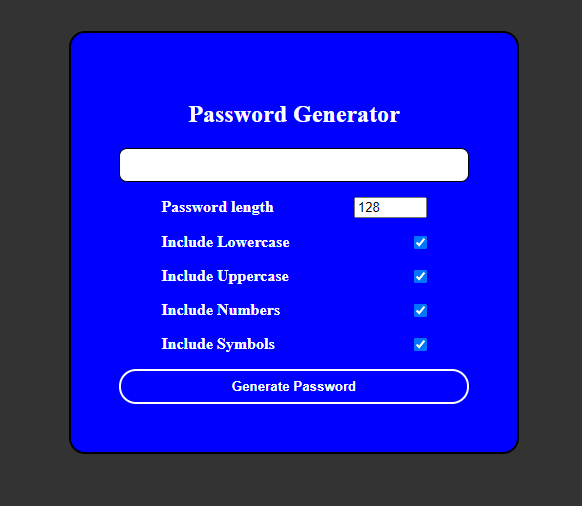

# password--generator

This a password generator allowing users to select options to generate a password. This is an interactive html page and functions using javascript.
This page can be tested at this link https://wisdommac1188.github.io/password--generator/

## image of password generator 

## setting length to 30 with all options selected

## Parameters 
* length
    * user can pick between 8 to 128 characters
* Lowercase
   * gives option to include lowercase characters in the password output 
* Uppercase
    * gives option to include uppercase characters in the password output
* Numbers
    * gives user option to include numbers in the password output
* Symbols
    * gives user option to include symbols in the password output

